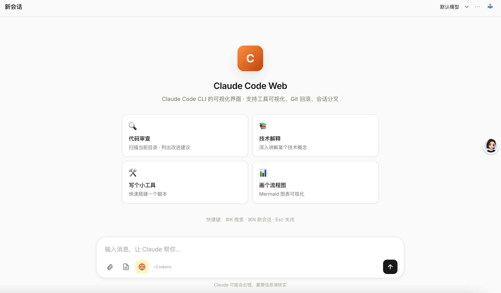
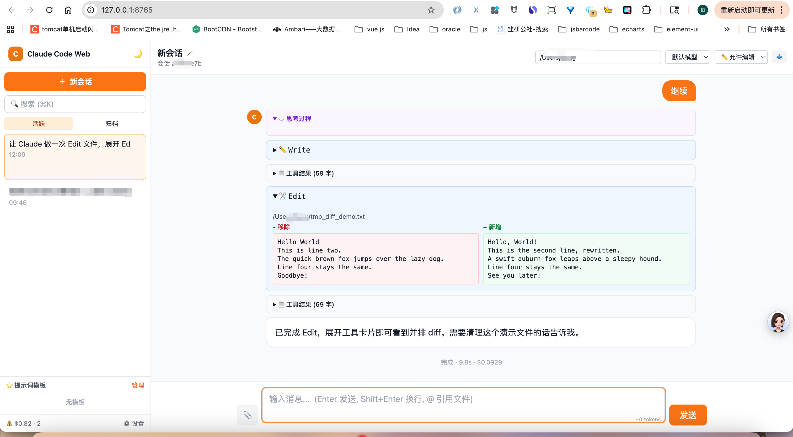
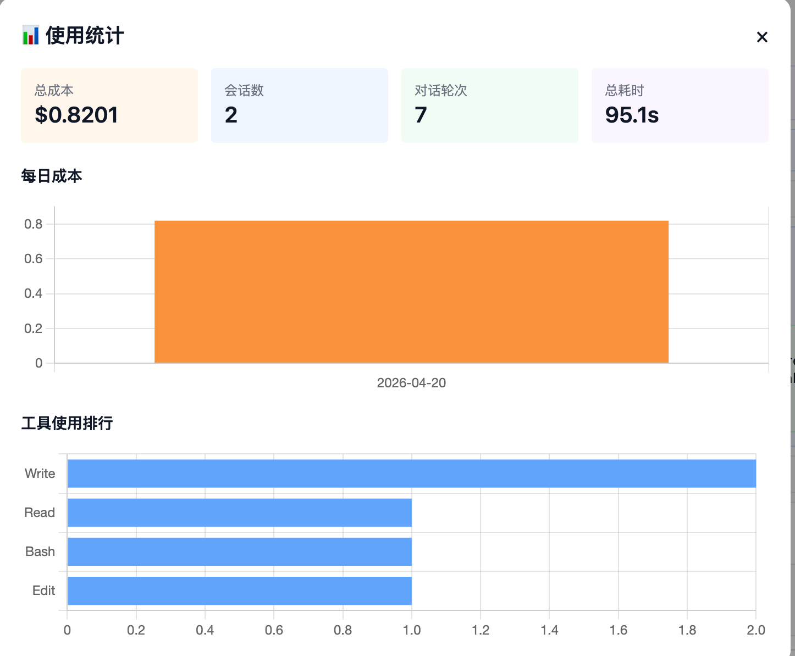

# Claude Code Web

一个给 [Claude Code](https://docs.claude.com/claude-code) CLI 加可视化界面的 Web 应用。后端用 FastAPI 包装 `claude -p --output-format stream-json`，前端通过 SSE 流式渲染对话、工具调用、思考过程。

> 🔒 **隐私说明**：本工具只是 `claude` CLI 的本地 GUI 包装器，不上传任何数据到第三方服务。所有对话、图片、会话历史都存在本机 `history/` `uploads/` `claude-web.db` 中。认证沿用你本地 `claude` 的登录态（`~/.claude/`），本工具不接触任何 API Key。

## 📸 截图

### 主对话界面


### Token 级流式输出 & 工具调用可视化


### Edit 工具并排 Diff


### 使用统计面板


### 暗黑模式


## ✨ 特性

### 💬 对话
- **Token 级流式输出**（打字机效果）
- 多轮对话（基于 `claude --resume`）
- 停止正在运行的任务

### 📝 输入
- 文本 + 图片（**文件选择 / 粘贴 / 拖拽**）
- `@` 引用工作目录下的文件（↑↓ 选择）
- Token 估算 + 草稿自动保存
- 提示词模板库

### 🎨 渲染
- Markdown + 代码高亮（highlight.js）
- 工具调用图标化（Bash / Read / Write / Edit 等）
- **Edit 工具并排 diff**
- **Mermaid** 图表 + **LaTeX** 公式
- 图片 Lightbox

### 🗂 会话管理
- 📌 置顶 / 📥 归档 / 🏷 标签
- 🪄 AI 智能命名（让 Claude 给会话起标题）
- 双击标题重命名
- 搜索（标题 + 内容）
- 导出为 Markdown

### 🛡 安全 & 回滚
- **权限策略**：自由 / 允许编辑 / 计划 / 只读 / 自定义工具列表
- **Git Checkpoint**：每轮对话前自动 `git stash create` 快照，一键回滚文件
- **编辑 / 重新生成**：基于任意历史消息分叉新会话

### 📊 其它
- 模型切换（Opus / Sonnet / Haiku）
- 使用统计（总成本 / 每日成本柱图 / 工具使用排行）
- Git 状态栏（branch / dirty）
- 暗黑模式
- 快捷键：`⌘K` 搜索 · `⌘N` 新会话 · `Esc` 关闭弹窗
- 浏览器通知 + 完成提示音
- 移动端响应式

---

## 🚀 快速开始

### 前置条件

1. **已安装 [Claude Code CLI](https://docs.claude.com/claude-code/quickstart)**：
   ```bash
   npm install -g @anthropic-ai/claude-code
   claude  # 首次登录
   ```
2. **Python 3.9+**

### 安装

#### 方式一：让 Claude Code 自己装（推荐 🎉）

既然 Claude Code 已经装好了，直接让它帮你装本项目：

```bash
claude
```

进入交互模式后，把下面这段话丢给它：

```
帮我安装 https://github.com/heng1234/claude-web 到 ~/claude-web 目录：
1. git clone 到 ~/claude-web
2. 在该目录下创建 Python 虚拟环境 .venv 并激活
3. pip install -r requirements.txt
4. 最后 python server.py 启动服务
启动成功后告诉我访问地址
```

Claude Code 会依次执行 `git clone`、`python -m venv`、`pip install`、`python server.py`，完成后浏览器打开 `http://127.0.0.1:8765` 即可。

> 💡 这是一个很有爱的闭环：用 Claude Code 给 Claude Code 装一个 Web UI。

#### 方式二：手动安装

```bash
git clone https://github.com/heng1234/claude-web.git
cd claude-web

python3 -m venv .venv
source .venv/bin/activate   # Windows: .venv\Scripts\activate
pip install -r requirements.txt
```

### 运行

```bash
python server.py
# 浏览器打开 http://127.0.0.1:8765
```

### 局域网共享（可选）

修改 `server.py` 末尾：
```python
uvicorn.run(app, host="0.0.0.0", port=port)
```
⚠️ 别暴露到公网，本工具**没有鉴权**。

### 自定义端口

```bash
PORT=9000 python server.py
```

---

## 🧩 技术栈

| 层 | 技术 |
|---|---|
| 后端 | Python 3.9+ · FastAPI · uvicorn · SQLite |
| 前端 | 原生 JS · TailwindCSS · marked.js · highlight.js · Mermaid · KaTeX · Chart.js |
| 协议 | Server-Sent Events（流式输出） |
| 依赖 | `claude` CLI（透过 subprocess 调用） |

## 📐 架构

```
浏览器 ──POST /api/chat──> FastAPI
                            └─ subprocess: claude -p --output-format stream-json \
                                           --include-partial-messages \
                                           [--session-id | --resume] \
                                           [--permission-mode | --allowed-tools]
                               └─ stdout JSON lines ──SSE──> 浏览器渲染
```

- 会话 ID 首轮前端生成 UUID 通过 `--session-id` 传入，后续用 `--resume`
- `--include-partial-messages` 开启 token 级流式
- 每轮对话前若 cwd 是 git 仓库，执行 `git stash create` 创建 checkpoint
- 会话元数据存 SQLite（`claude-web.db`），事件流存 JSONL（`history/{session_id}.jsonl`）

---

## 📁 项目结构

```
claude-web/
├── server.py              # FastAPI 主服务
├── static/
│   └── index.html         # 单页前端
├── requirements.txt
├── history/               # 会话事件 JSONL（运行时生成，gitignore）
├── uploads/               # 上传的图片（运行时生成，gitignore）
├── claude-web.db          # SQLite 会话元数据（运行时生成，gitignore）
└── .venv/                 # 虚拟环境（gitignore）
```

---

## ⚠️ 已知限制

- **权限审批是策略级**：不是 Cursor 那种每次弹窗确认，而是会话启动时选策略。要实现真交互级权限需自建 MCP 权限服务器。
- **Checkpoint 仅限 git 仓库**：非 git 目录跳过（后续可加 tar 快照）。
- **分叉会话会打包上下文**：编辑/重新生成时把历史作为前缀发给 Claude（可能多消耗 token）。
- **无鉴权**：仅供本地使用，不建议直接暴露公网。

---

## 🗺 Roadmap

- [ ] Artifacts 侧边预览（HTML/React 实时渲染）
- [ ] PDF / CSV / Word 上传
- [ ] MCP server 管理面板
- [ ] Slash 命令透传（`/compact` `/clear` `/init`）
- [ ] 导入 `~/.claude/projects/` 原生会话
- [ ] 基于 MCP 的真·交互审批
- [ ] 简单鉴权（Token / 密码）
- [ ] 内嵌终端（xterm.js）

---

## 🤝 贡献

欢迎 Issue / PR。

## 📄 License

MIT — 见 [LICENSE](LICENSE)

## 🙏 致谢

- [Claude Code](https://docs.claude.com/claude-code) — Anthropic
- [FastAPI](https://fastapi.tiangolo.com/) · [TailwindCSS](https://tailwindcss.com/) · [marked](https://github.com/markedjs/marked)
